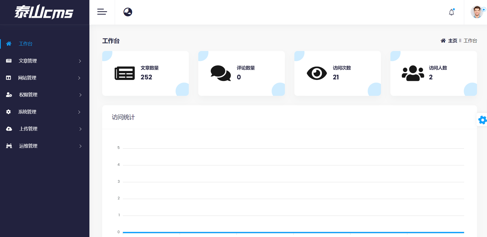
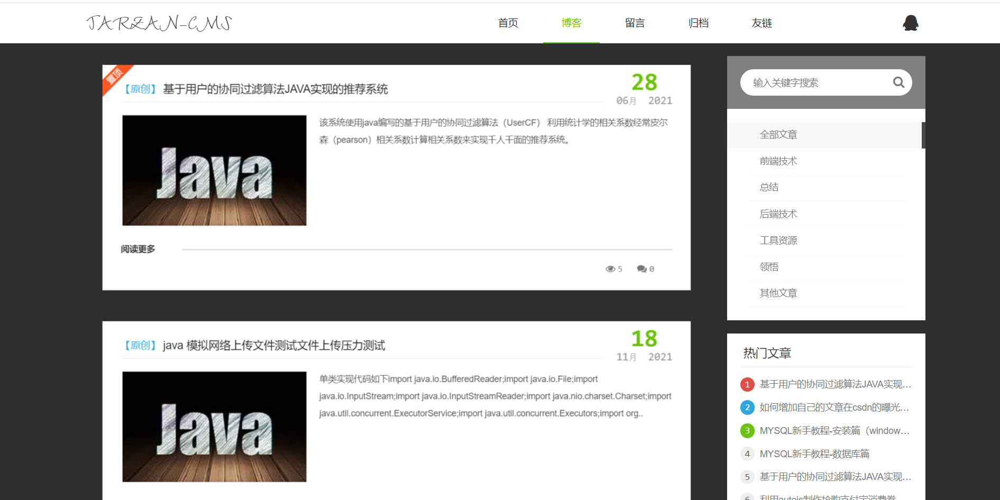
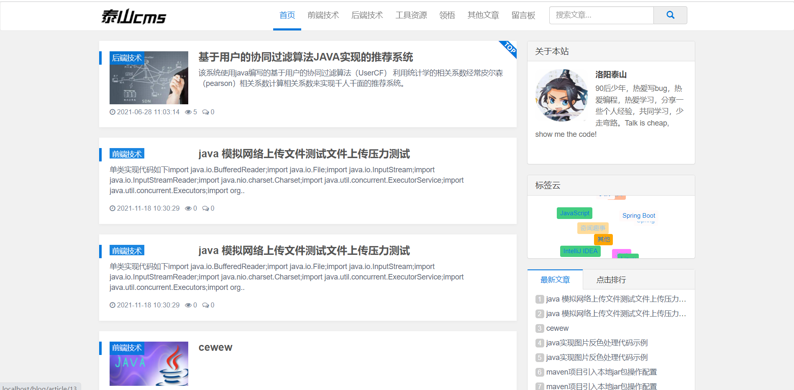

# 泰山出品-java版CMS内容管理系统

#### 介绍
泰山出品-java版CMS内容管理系统
目的在打造一个简单易用的CMS内容管理系统，方便不懂技术的小微企业快速建站，个人建设博客，打造个人IP。

#### 软件架构

软件架构说明
| 名称  |  技术栈  |
|---|---|
| 前端模板  |   thyleaf |
| 后端技术  |  springboot  |  
| ORM 框架  |  mybatis-plus  | 
| 缓存技术  |  redis  |
| 安全框架  | Apache Shiro  |
|  日志组件 |   logback |
|  数据库 |  mysql 或者h2（默认） |
| 版本管理  |   git |
| 构建工具  |  maven |


#### 功能导图

#### 网站截图



#### 环境准备
下载安装JDK
https://www.oracle.com/java/technologies/javase/javase8-archive-downloads.html
推荐使用 jdk8或者jdk11

#### 环境安装
**linux快速安装jdk11**
```
yum install -y java-11-openjdk.x86_64 
```
#### 快速开始

 **Fat Jar** 
下载最新的 tarzan-cms 运行包：

```
curl -L https://gitee.com/taisan/tarzan-cms/attach_files/1003268/download/tarzan-cms.jar --output tarzan-cms.jar
```
 **命令行运行** 

```
java -jar tarzan-cms.jar
```
 **Docker** 

```
docker run -it -d --name tarzan-cms -p 8080:8080 -v ~/.tarzan-cms:/root/.tarzan-cms --restart=always tarzan-cms-hub/tarzan-cms
```

#### 我的博客

[洛阳泰山博客](http://https://blog.csdn.net/weixin_40986713)

#### 演示地址

**前台地址：**

[输入链接说明](http://82.157.61.108)

**后台地址：**

[输入链接说明](http://http://82.157.61.108/admin)


账号：admin 密码： 123456
